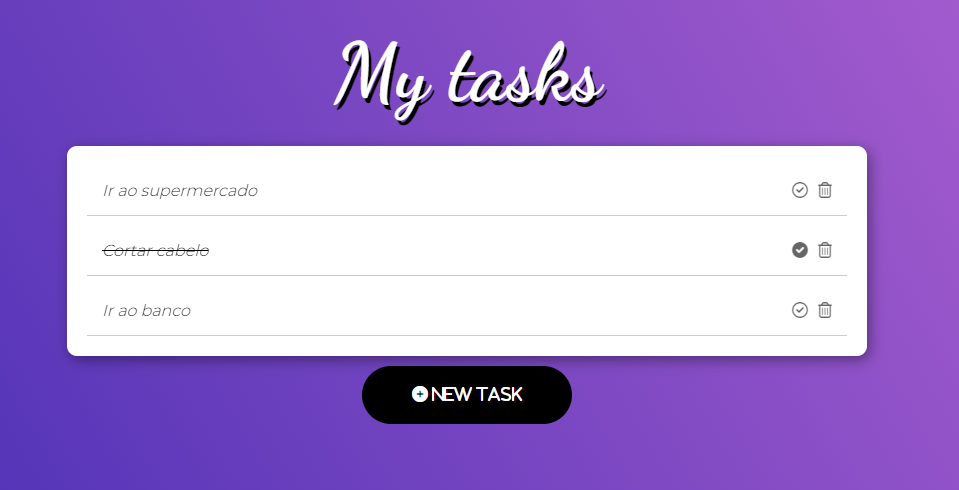
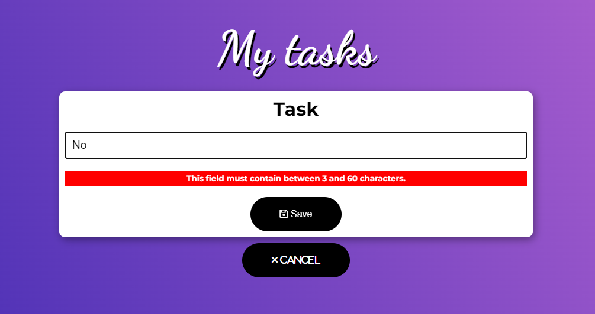

<h1 align='center'>ToDo List</h1>
<p align='center'>


</p>

## 🔖 Descrição
<p>📱 Aplicação de lista de tarefas criada em Angular. Curso: <a href="https://www.youtube.com/c/baltaio" target="_new">Balta.io</a><p>

## ⚙️ Funcionalidades
- Tela para criação das novas tarefas;
- Tela com exibição das tarefas e possibilidade de concluir e excluir;

## 🚀 Tecnologias
Esse projeto está utilizando as seguintes tecnologias:
- HTML
- CSS
- JavaScript
- [Angular](https://angular.io/)
- [Typescript](https://www.typescriptlang.org/)


## 🎲 Como utilizar
### Clone esse repositório
```bash
git clone https://github.com/rafaasimi/todo-angular.git
```
### Navegue até o diretório
```bash
cd todo-angular
```
### Instale as dependências
```bash
npm i
```
```bash
yarn
```
### Inicie a aplicação
```bash
ng serve
```


## 🖼️ Layout




## 📝 Licença
<p>O projeto se encontra sob licença MIT. Para mais detalhes, acesse <a href='LICENSE'>license<a>.</p>

---
<p>Criado com 💙 por <a href='https://github.com/rafaasimi/' target='_blank'>Rafael Simionato</a></p>